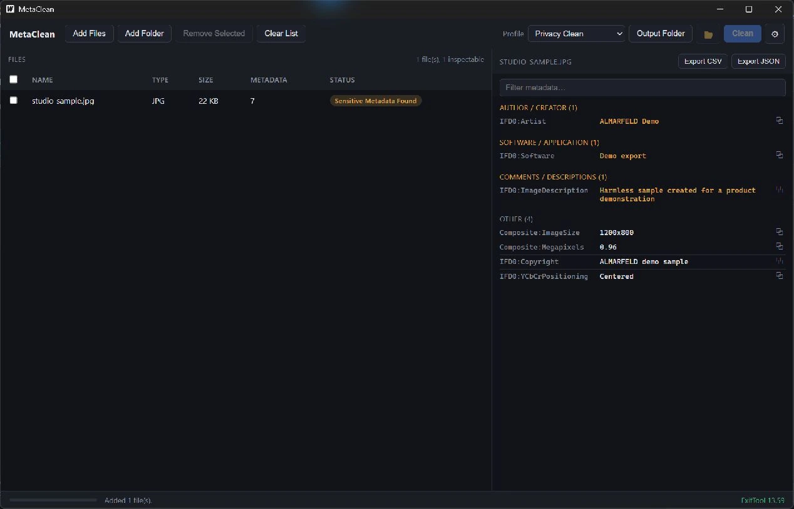

# MetaClean

MetaClean is a Windows desktop utility that lets you inspect and remove
hidden metadata from files before sharing them — GPS location, author
names, camera/device info, software fingerprints, and more. It runs
entirely offline, with no accounts, no telemetry, and no cloud dependency.

Under the hood, MetaClean uses [ExifTool](https://exiftool.org) (Phil
Harvey) as its metadata engine, bundled with the application — you never
need to install it yourself.

## Current release and download

[MetaClean v1.0.0](https://github.com/AlinTibi/MetaClean/releases/tag/v1.0.0)
is the current Windows x64 release.

[Download the portable ZIP](https://github.com/AlinTibi/MetaClean/releases/download/v1.0.0/MetaClean-v1.0.0-win-x64.zip),
extract it, and run `MetaClean.exe`. Keep the extracted files together.
Microsoft Edge WebView2 Runtime is required. Install it separately if missing.
Keep the bundled `exiftool/` directory beside `MetaClean.exe`.

## v1.0.1 release candidate

The next patch refreshes the inspector and exported reports from the actual
cleaned file, retains partial-failure details, resolves ExifTool independently
of the working directory, and adds a distinct privacy-shield/eraser icon.
See [candidate release notes](RELEASE_NOTES.md). v1.0.0 remains the public release.

## Screenshots



## Supported formats

| Format | Inspect metadata | Remove metadata |
|---|---|---|
| JPG / JPEG | ✅ | ✅ |
| PNG | ✅ | ✅ |
| TIFF | ✅ | ✅ |
| WEBP | ✅ | ✅ |
| HEIC / HEIF | ✅ (if the bundled ExifTool build supports it) | ✅ |
| PDF | ✅ | ✅ |
| DOCX | ✅ | ❌ (read-only — see below) |
| XLSX | ✅ | ❌ (read-only — see below) |
| PPTX | ✅ | ❌ (read-only — see below) |

**Office Open XML files (.docx/.xlsx/.pptx) are inspection-only.** ExifTool
can read their embedded metadata (author, company, manager, comments,
timestamps, ...) but does not support writing/removing it. MetaClean will
not pretend otherwise: attempting to clean one of these files returns a
clear, specific error instead of silently doing nothing or producing a
broken file.

## Features

- Drag & drop files or folders, or use Add Files / Add Folder
- Batch queue with filename, type, size, metadata count, and a clear
  per-file status (Clean / Metadata Found / Sensitive Metadata Found /
  Unsupported / Error)
- Metadata inspector grouped by category, with sensitive categories
  highlighted: GPS/location, author/creator, camera/device,
  software/application, company/manager, comments/descriptions, and
  removable timestamps
- Search/filter the inspector, copy any value to the clipboard
- Three cleaning modes: **Privacy Clean** (common personal/privacy fields,
  keeps the file otherwise usable), **Remove All Metadata**, and
  **Custom** (pick exactly which categories to strip)
- Safe by default: cleaning writes a cleaned **copy** with a
  configurable suffix (default `_clean`) into a folder you choose —
  your originals are never touched
- Optional "Replace original" mode, gated behind an explicit warning and
  confirmation, which backs up the original first (plus ExifTool's own
  backup) before modifying it in place
- Automatic before/after verification: MetaClean re-scans every cleaned
  file and reports exactly what metadata (if any) remains
- Export a CSV metadata report or a JSON privacy report for the whole
  queue
- Cancel an in-progress batch; the UI stays responsive throughout since
  cleaning runs in the background
- Dark, compact, professional UI

## PDF limitations

ExifTool edits PDF metadata incrementally. Previous metadata may remain in the
file and can be recovered. A clean metadata scan does not prove secure PDF
sanitization or anonymization. Review the document content separately and do not
rely on MetaClean to remove confidential text, images, or earlier PDF revisions.

## Privacy & safety

- **Fully offline.** No network calls at runtime, no telemetry, no
  accounts, no cloud upload of your files or their metadata.
- **Non-destructive by default.** Cleaning never modifies your original
  files unless you explicitly opt into "Replace original" mode, and even
  then a backup is made first.
- **No silent failures.** If ExifTool can't process a file (wrong format,
  corrupt file, unsupported write), MetaClean reports a specific error
  instead of pretending the file was cleaned.

## Build from source

Requirements:

- Go 1.25+
- Node.js 22.12+
- The [Wails v2 CLI](https://wails.io/docs/gettingstarted/installation),
  pinned to the version in `go.mod`:
  `go install github.com/wailsapp/wails/v2/cmd/wails@v2.16.0`

```powershell
# Fetch the pinned ExifTool build for local dev (gitignored, never committed)
./scripts/fetch-exiftool.ps1

# Run the Go test suite
cd frontend
npm ci
npm test
npm run build
cd ..
$env:METACLEAN_EXIFTOOL_PATH = (Resolve-Path tools/exiftool/exiftool.exe).Path
go test ./...

# Launch in dev mode (hot reload)
wails dev

# Build a production executable (build/bin/MetaClean.exe)
# then copy tools/exiftool next to it as build/bin/exiftool for a full local run
wails build -clean -s -webview2 browser
./scripts/package-release.ps1 -Tag v1.0.1
```

The published release ZIP bundles `MetaClean.exe` together with an
`exiftool/` folder containing the pinned ExifTool build — MetaClean looks
for it right next to its own executable at runtime.
Source-checkout builds also search above their executable directory; they never
search the current working directory. Tests and `go run` can use the explicit
absolute `METACLEAN_EXIFTOOL_PATH` override. Missing engines produce a clear
error; MetaClean does not search PATH or download them.

## Architecture

Backend logic is fully decoupled from the UI, each package with a single
responsibility:

- `internal/exiftool` — locates and executes the bundled ExifTool binary
  directly (no shell, no PowerShell at runtime) and parses its JSON output
- `internal/scanner` — classifies tags into privacy categories and builds
  `FileEntry` results
- `internal/cleaner` — builds removal commands per cleaning profile and
  safely executes them (copy-by-default, backup-then-replace, verification)
- `internal/report` — CSV and JSON report export
- `internal/model` — shared types used across every package and exposed
  to the frontend
- `internal/settings` — local settings persistence
- `app.go` — a thin Wails binding layer over the packages above
- `frontend/` — the Wails/Vite + vanilla TypeScript UI

## Known limitations

- Metadata **removal** is not supported for DOCX/XLSX/PPTX (ExifTool
  limitation) — inspection works fully for these formats.
- HEIC support depends on the bundled ExifTool build; MetaClean does not
  add any HEIC handling of its own.
- "Add Folder" only picks up files with a supported extension; it does
  not add unrecognized file types to the queue.
- The Timestamps category targets XMP-level dates; some Office-document
  timestamps are only removable via "Remove All Metadata".
- ExifTool's official SourceForge download blocks automated/CI traffic
  with HTTP 403 (confirmed from a real GitHub Actions runner, not just
  locally), so `scripts/fetch-exiftool.ps1` sources it via the
  exiftool-vendored.exe npm package instead — see "ExifTool attribution"
  below for the full reasoning and what is/isn't verified.

## ExifTool attribution

MetaClean bundles ExifTool, Phil Harvey's software, unmodified. His
official Windows build is published via SourceForge, but that download
blocks automated/CI requests with HTTP 403 — verified against a real
GitHub Actions `windows-latest` runner, not just a local network quirk.
Both the release workflow and the local dev fetch script
(`scripts/fetch-exiftool.ps1`) instead obtain the identical, unmodified
binary via the **exiftool-vendored.exe** npm package (MIT-licensed
wrapper; ExifTool itself keeps its own license), pinned to the package
version that vendors ExifTool 13.59 and verified against npm's own
published integrity hash before use. See
[THIRD_PARTY_NOTICES.md](THIRD_PARTY_NOTICES.md) for the full reasoning,
the official exiftool.org checksums kept for reference, and licensing
details.

## License

MetaClean's source code is [MIT licensed](LICENSE). The bundled ExifTool
binary retains its own license — see
[THIRD_PARTY_NOTICES.md](THIRD_PARTY_NOTICES.md).

## Support and security

For software questions, email [support@almarfeld.com](mailto:support@almarfeld.com).
Report reproducible bugs and feature requests in [MetaClean issues](https://github.com/AlinTibi/MetaClean/issues).
Do not post private files or credentials in public issues.

Report vulnerabilities privately to [security@almarfeld.com](mailto:security@almarfeld.com).
See [SUPPORT.md](SUPPORT.md) and [SECURITY.md](SECURITY.md).

---

**ALMARFELD** · Independent software development · [almarfeld.com](https://almarfeld.com)

[MetaClean product page](https://almarfeld.com/software/metaclean/) ·
[General enquiries](mailto:contact@almarfeld.com) · [MIT license](LICENSE)
